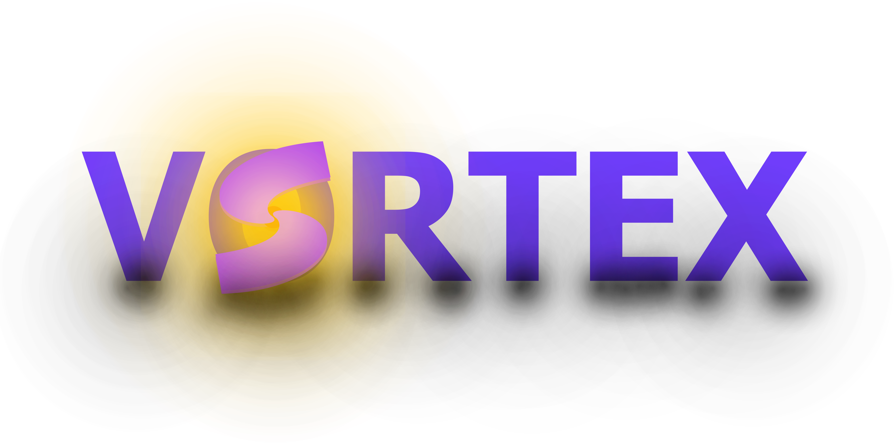

# Vortex RTDE (Real Time Development Environment!)

## The Next Gen Real Time Development Environent For Web.

## Checklist:

- Design Logo for Vortex

- Build docs webpage.

- (Add UMD Bundle Mode support for libraries)

- Add syntax word to change name of Planet.

- Finish support for addons.

### LivePush Checklist

- [x] Add Updater.
 - [x] mininize request diffs(make function that returns only import/require diffs.)
- [x] Css Support
- [ ] Support For Images.
- [ ] Addon Support! 

